[2021-2022学年第2学期]

# [**实 验 报 告**]


- 课程名称:编程语言原理与编译
- 实验项目:期末大作业
- 专业班级__计算机1901_
- 学生学号_ 31904027_ 31903139_
- 学生姓名 倪敏建  许周毅
- 实验指导教师:张芸


# 1.简介

​	编译原理是计算机专业的一门重要专业课，旨在介绍编译程序构造的一般原理和基本方法。内容包括语言和文法、词法分析、语法分析、语法制导翻译、中间代码生成、存储管理、代码优化和目标代码生成。 编译原理是计算机专业设置的一门重要的专业课程。编译原理课程是计算机相关专业学生的必修课程和高等学校培养计算机专业人才的基础及核心课程，同时也是计算机专业课程中最难及最挑战学习能力的课程之一。	

​	一开始接触这个大作业，有些手足无措，涉及的内容太过繁杂，与之前的知识体系没有接轨，学习成本过高。后仔细研读老师提供的材料，逐渐被这门课所吸引，原来这个世界上存在着这么多有趣的语言，它们有各自的特色，有些为特殊的使用场景设计。

​	microC的设计更是令人惊叹，我们最终选择了它作为我们的大作业方向。

#  2.语言手册

## 解释器

```shell
dotnet restore  interpc.fsproj
dotnet clean  interpc.fsproj
dotnet build -v n interpc.fsproj
dotnet run -p interpc.fsproj .\example\commentaryTest.c 
```

## 编译器

```shell
#虚拟机编译
gcc machine.c -o machine 
```

```shell
dotnet restore  microc.fsproj #恢复项目的依赖项和工具
dotnet clean  microc.fsproj #清除项目输出
dotnet build  microc.fsproj #生成项目及其所有依赖项
dotnet run --project microc.fsproj .\example\xxx.c xxx(可选)  # 编译 xxx表示输入的数据，下同
.\machine.exe .\example\xxx.out xxx  # 执行（通过虚拟机执行）

###相关说明：
已弃用使用缩写“-p”来代表“--project”。请使用“--project”。
framework 'Microsoft.NETCore.App', version '5.0.0' (x64)
###
```

## 优化

```shell
#microc-->microcc
dotnet restore  microcc.fsproj
dotnet clean  microcc.fsproj
dotnet build  microcc.fsproj
dotnet run --project microcc.fsproj .\example\xxx.c xxx(可选)  # 编译 xxx表示输入的数据，下同
.\machine.exe .\example\xxx.out xxx  # 执行（通过虚拟机执行）
```

## 中间过程

```shell
###----------编译器----------
-- dotnet fsi
-- #r "nuget: FsLexYacc";;
-- #load "Absyn.fs"  "CPar.fs" "CLex.fs" "Debug.fs" "Parse.fs" "Machine.fs" "Backend.fs" "Comp.fs" "ParseAndComp.fs";; 
-- open ParseAndComp;;
-- fromFile "example\xxx.c"
-- compileToFile (fromFile "example\xxx.c") "xxx";; #有点问题
-- #q;;

###----------优化编译器----------
-- dotnet fsi
-- #r "nuget: FsLexYacc";;
-- #load "Absyn.fs"  "CPar.fs" "CLex.fs" "Debug.fs" "Parse.fs" "Machine.fs" "Backend.fs" "Contcomp.fs" "ParseAndContcomp.fs";;
-- open ParseAndContcomp;;
#-----查看中间AST生成-----（抽象语法树）
-- fromFile "example\xxx.c" 
#优化编译虚拟指令序列
-- contCompileToFile (fromFile "example\xxx.c") "xxx.out";;
-- #q;;
```

# 3.结构设计
前端：由`F#`语言编写而成  

- `Absyn.fs`: 抽象语法树结构的定义，定义变量描述、函数和类型的构造方法
- `CLex.fsl`: 词法定义(将输入分解成一个个独立的词法符号)
  + CLex 中定义基本的关键字、标识符、常量、进制转化函数、转移函数等，遇到对应字符会模式匹配到目标字符，然后就给 CPar 处理
- `CPar.fsy`: 语法定义(分析程序的短语结构)
  + CPar 文件分为两部分
  + 第一部分声明需要使用的变量(词元)，声明变量后还需要声明优先级
  + 第二部分定义语法规则(文法)包括 : statement ,expression ,function ,main ,vardeclare variabledescirbe ,type ,const这些基本元素
  + 表示识别到前面定义的这些大写字母组成的符号串后,怎么处理这些规则
- `CPas.fsy`: 语义分析(推算程序的含义)
- `Parse.fs`: 语法解析器（从文件或字符串中获取抽象语法树）
- `Interp.fs`: 解释器
- `Comp.fs`：编译器(将高级语言翻译为低级语言)
  - 相关：System.IO、Absyn.fs、Machine.fs、Debug.fs、Backend.fs、microc.fs、microc.fsproj
- `Machine.fs`：栈式虚拟机，machine.c
- `Contcomp.fs`: 优化编译器
- `example`:存放测试程序


# 4.测试方案

## 4.1 词法功能

### 4.1.1 注释表示方式

- 实现注释表达方式  `//` 	`/* */`    `(* *)`

- 测试样例 (commentaryTest.c)

  ```c
  void main()
  {
    int i = 5;
    (*for (; i < 10; i++); *)
        printf i;
  }
  ```
  
- 测试结果

解释：

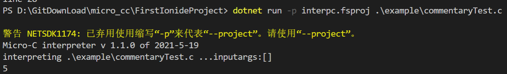

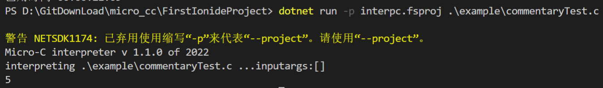

编译：

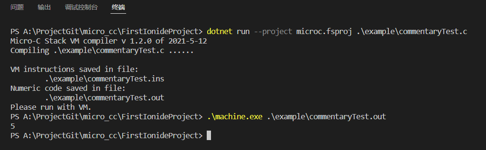

中间过程：（中间过程用优化编译器测试，下同）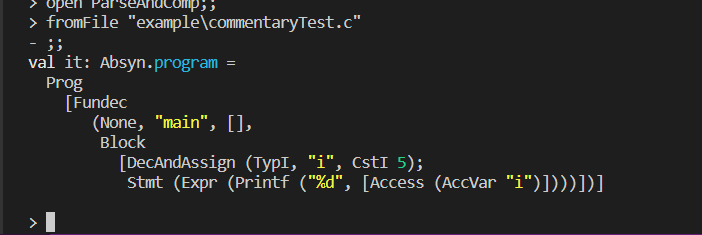

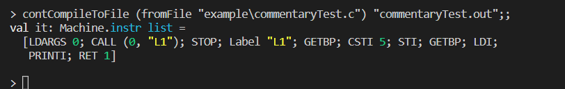

### 4.1.2 标识符定义

- 标识符定义方式：允许_开头

- 测试样例 (IdentifierDefinition.c)

```
void main()
{
  int _x = 1;
  int _y = 2;
  printf("%d\n", _x);
  printf("%d", _y);
}
```

- 测试结果


解释


编译：

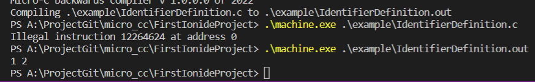

中间过程：

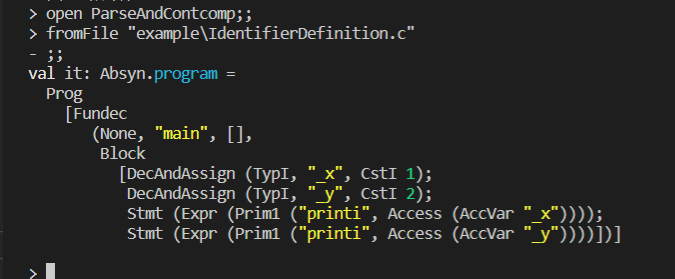

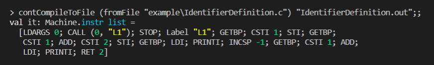

### 4.1.3 进制转换

- 进制转换：0b-二进制、0o-八进制、十进制、0x-十六进制

- 测试样例 (RadixConversion.c)

  ```
  void main()
  {
    int x = 0b111;
    int y = 0o111;
    int z = 111;
    int k = 0x111;
    print x;
    print y;
    print z;
    print k;
  }
  ```

- 测试结果 


解释


编译：

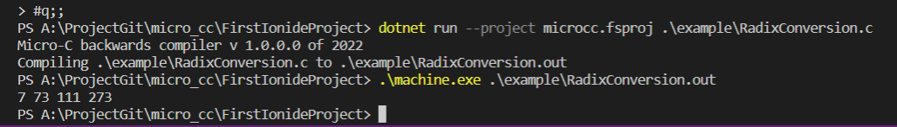

中间过程：

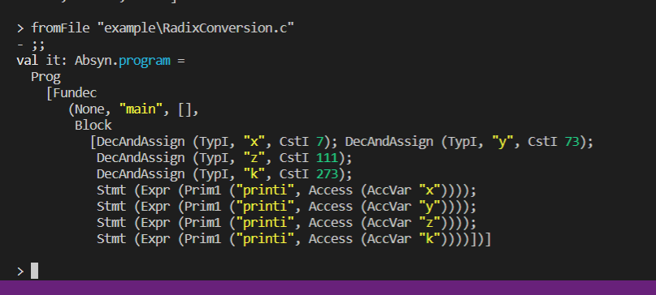

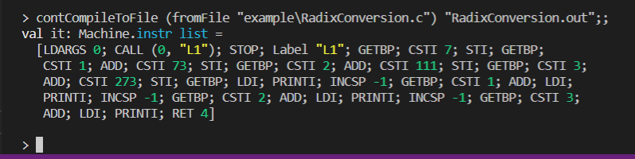

## 4.2 语法功能

### 4.2.1 for循环

- 测试for的循环功能

- 测试样例 (ForKeyWord.c)

  ```
  void main(int n)
  {
    int i = 0;
    int j = 0;
  
    for (i = 0; i < n; i = i + 1)
    {
      print i;
      for (j = 0; j < i; j = j + 1)
      {
        print j;
      }
    }
  }
  ```
  
- 测试结果


解释器

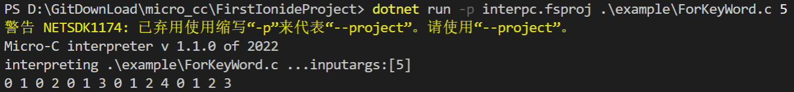

编译：

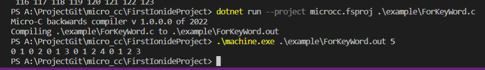

中间过程：

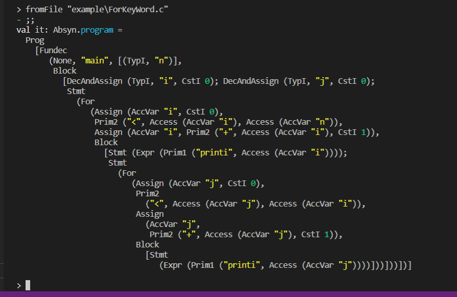

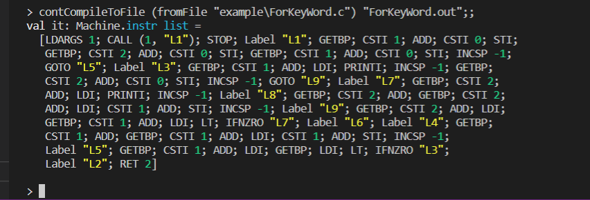

### 4.2.2 do-while循环实现

- 测试do-while的循环功能

- 测试样例 (DoWhileKeyWord.c)

  ```
  void main(int n)
  {
    int x = 0;
    do
    {
      x += 2;
      print x;
      print " "
    } while (x < n);
  }
  ```

- 测试结果


解释器


编译：

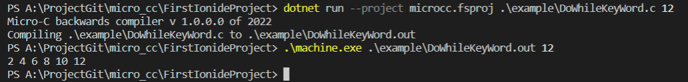

中间过程：

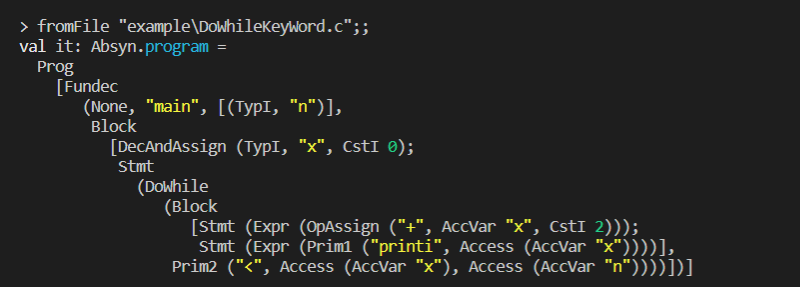

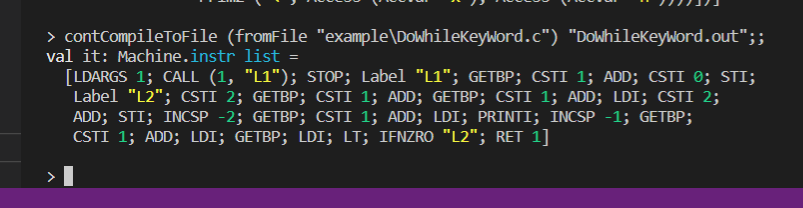

### 4.2.3 switch-case判断

- 测试switch-case的判断功能

- 测试样例 (SwitchCaseKeyWord.c)

  ```
  void main(int n)
  {
    switch (n)
    {
    case 0:
      printf("Cheslsea");
    case 1:
      printf("Liverpool");
    default:
      printf("Manchester City");
    }
  }
  ```

- 测试结果


解释器


编译：

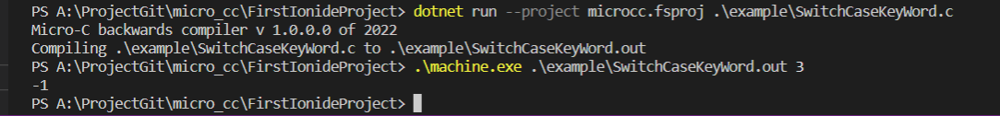

中间过程：

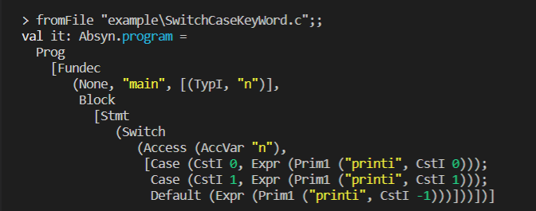

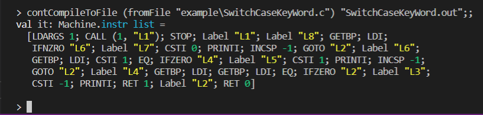

# 5.课程心得


# 6.附录

## 分工

| 姓名   | 学号     | 班级       | 任务                                     | 权重 |
| ------ | -------- | ---------- | ---------------------------------------- | ---- |
| 倪敏建 | 31904027 | 计算机1901 | 功能设计, 解释器，虚拟机，测试，报告撰写 | 0.95 |
| 许周毅 | 31903139 | 计算机1901 | 功能设计, 编译器，虚拟机，测试，报告撰写 | 0.95 |

## 日志

## 自评

| 功能 | **解释器** | **编译器** | 编译器优化 | 自评分（1-5） | 测试文件 |
| :--: | :--------: | :--------: | :--------: | :-----------: | :------: |
|      |            |            |            |               |          |
|      |            |            |            |               |          |
|      |            |            |            |               |          |
|      |            |            |            |               |          |
|      |            |            |            |               |          |
|      |            |            |            |               |          |
|      |            |            |            |               |          |
|      |            |            |            |               |          |
|      |            |            |            |               |          |
|      |            |            |            |               |          |
|      |            |            |            |               |          |
|      |            |            |            |               |          |
|      |            |            |            |               |          |
|      |            |            |            |               |          |
|      |            |            |            |               |          |
|      |            |            |            |               |          |
|      |            |            |            |               |          |
|      |            |            |            |               |          |
|      |            |            |            |               |          |
|      |            |            |            |               |          |
|      |            |            |            |               |          |
|      |            |            |            |               |          |
|      |            |            |            |               |          |
|      |            |            |            |               |          |
|      |            |            |            |               |          |
|      |            |            |            |               |          |
|      |            |            |            |               |          |
|      |            |            |            |               |          |
|      |            |            |            |               |          |
|      |            |            |            |               |          |
|      |            |            |            |               |          |
|      |            |            |            |               |          |
|      |            |            |            |               |          |
|      |            |            |            |               |          |
|      |            |            |            |               |          |
|      |            |            |            |               |          |
|      |            |            |            |               |          |
|      |            |            |            |               |          |
|      |            |            |            |               |          |
|      |            |            |            |               |          |
|      |            |            |            |               |          |
|      |            |            |            |               |          |
|      |            |            |            |               |          |
|      |            |            |            |               |          |
|      |            |            |            |               |          |
|      |            |            |            |               |          |
|      |            |            |            |               |          |
|      |            |            |            |               |          |
|      |            |            |            |               |          |
|      |            |            |            |               |          |
|      |            |            |            |               |          |
|      |            |            |            |               |          |
|      |            |            |            |               |          |
|      |            |            |            |               |          |
|      |            |            |            |               |          |
|      |            |            |            |               |          |
|      |            |            |            |               |          |
|      |            |            |            |               |          |
|      |            |            |            |               |          |
|      |            |            |            |               |          |
|      |            |            |            |               |          |
|      |            |            |            |               |          |
|      |            |            |            |               |          |
|      |            |            |            |               |          |
|      |            |            |            |               |          |
|      |            |            |            |               |          |
|      |            |            |            |               |          |
|      |            |            |            |               |          |
|      |            |            |            |               |          |
|      |            |            |            |               |          |
|      |            |            |            |               |          |
|      |            |            |            |               |          |
|      |            |            |            |               |          |
|      |            |            |            |               |          |
|      |            |            |            |               |          |
|      |            |            |            |               |          |
|      |            |            |            |               |          |
|      |            |            |            |               |          |
|      |            |            |            |               |          |

